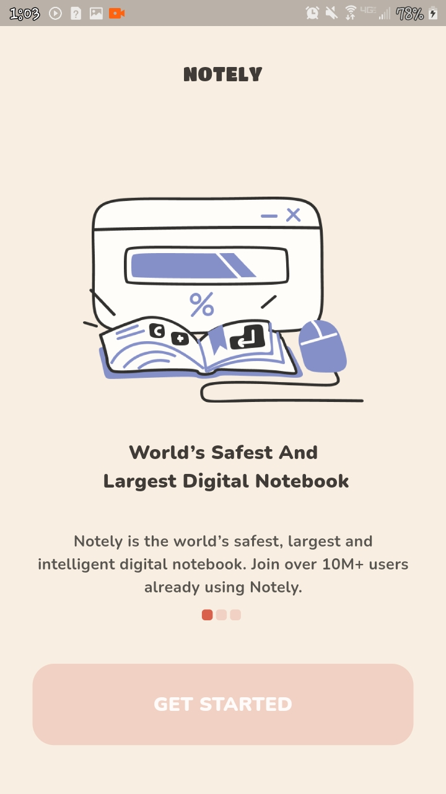
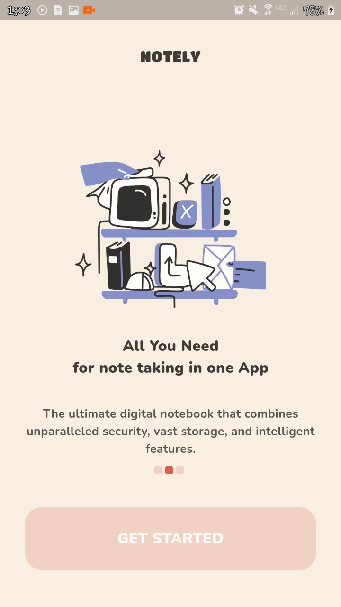
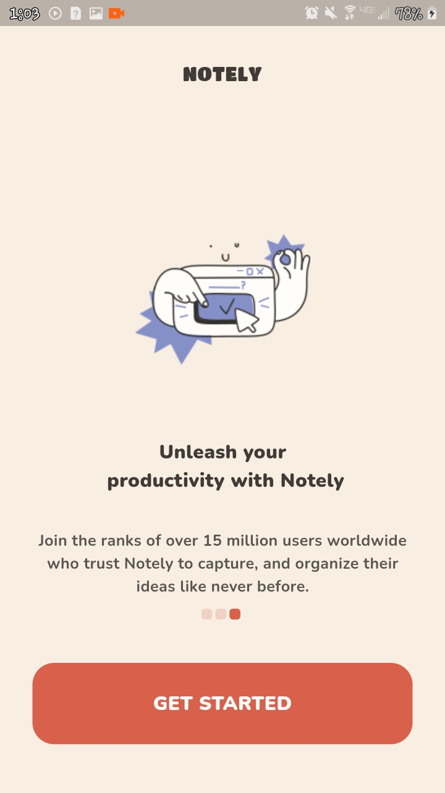
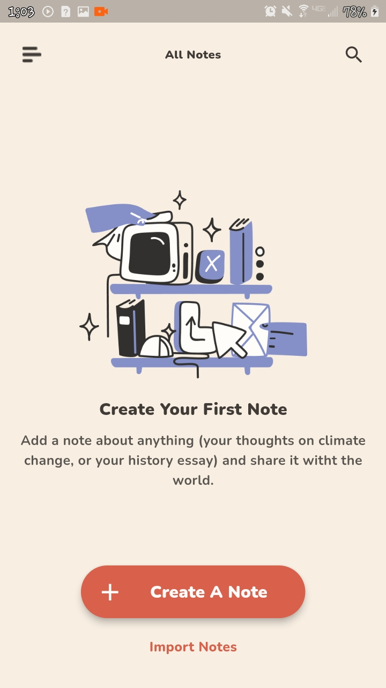
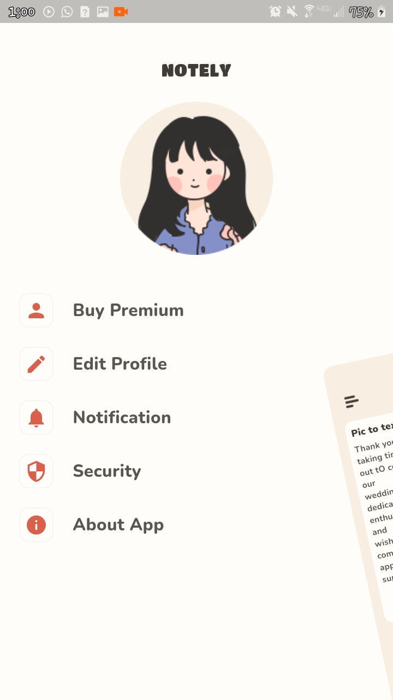
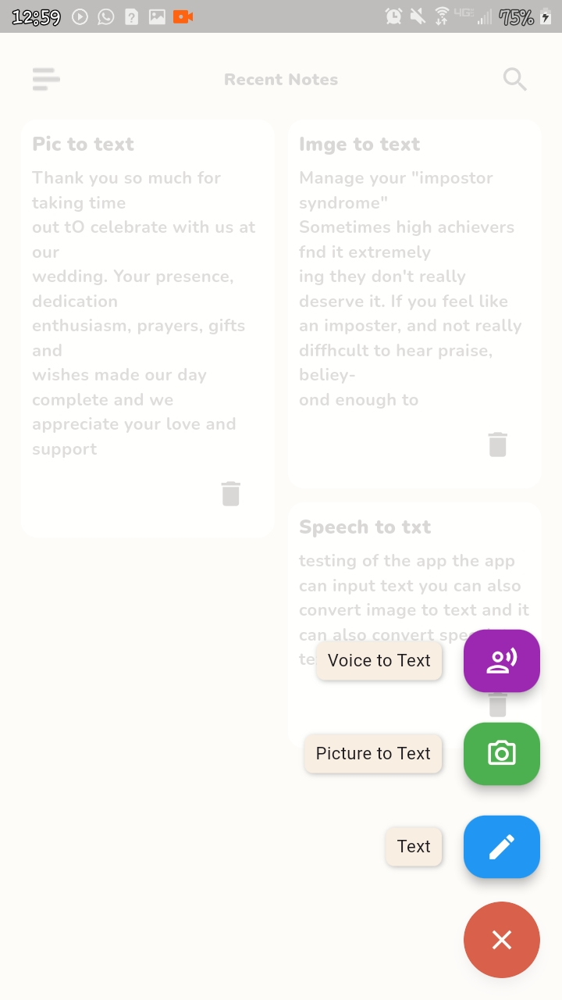
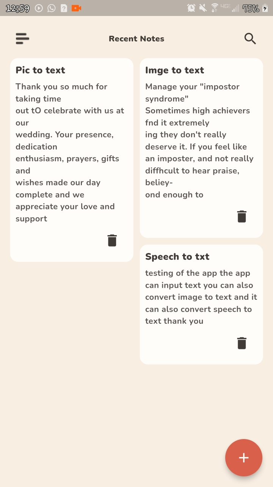
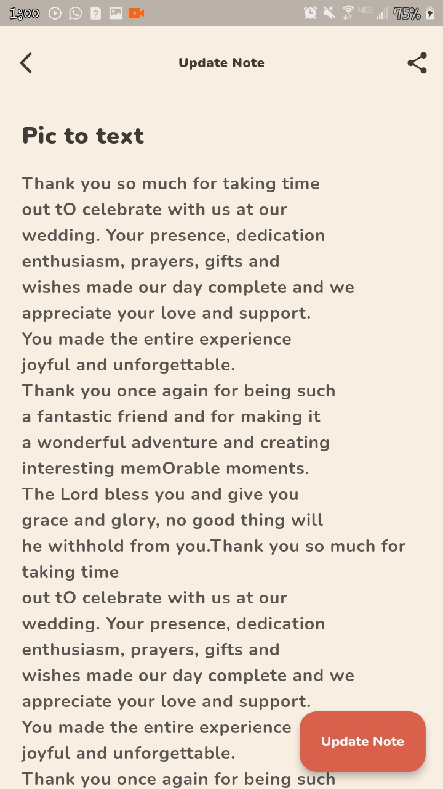
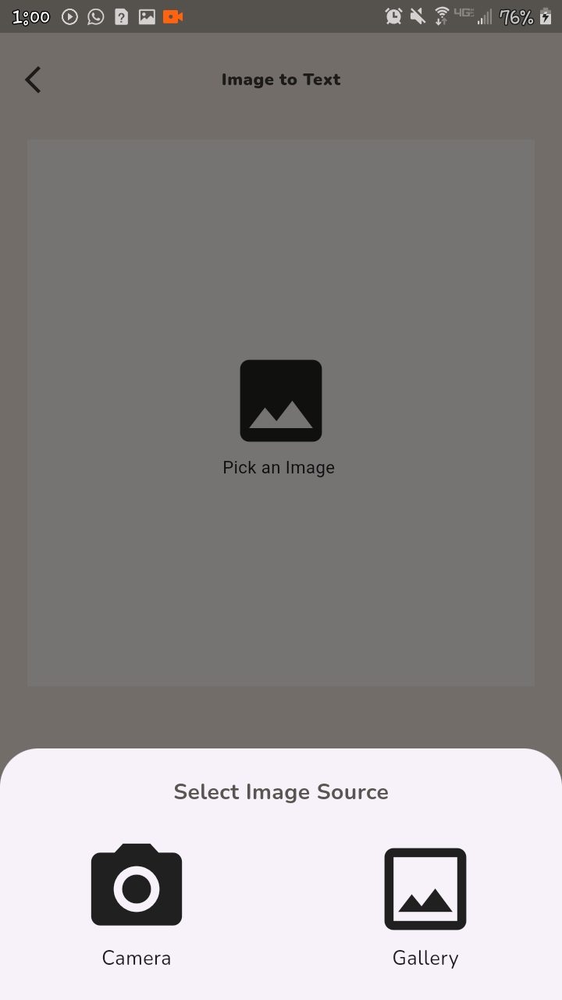
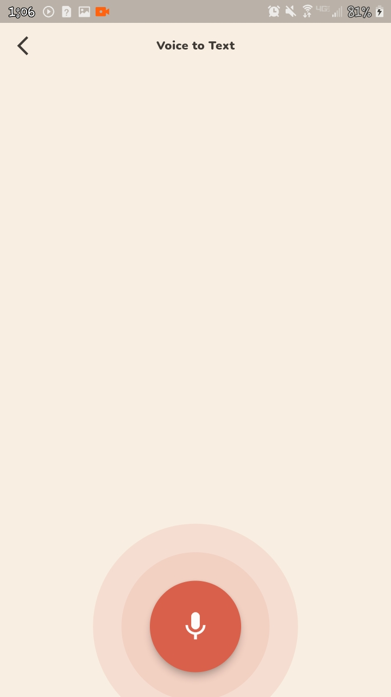

# Notely

## About App
A Note Taking App using hive for local storage, ML google kit for machine learning functionalities written using flutter - clean architecture and provider for state management.  

### Functionalities
- Text input via keyboard
- Picture to text conversion using ML google kit package
- Audio to text conversion using ML google kit package
- Can share text 
- Save text locally using hive flutter package

### Packages used
- Hive
- ML google kit
- Provider
- Hive 
- draggable fab
- flutter_speed_dial
- image_picker
- get_it
- share_plus
- shared_preferences

#
##
## Screenshots of App interface

 1&nbsp;&nbsp;&nbsp;   2&nbsp;&nbsp;&nbsp;  3&nbsp;&nbsp;&nbsp;  

 5&nbsp;&nbsp;&nbsp;   6&nbsp;&nbsp;&nbsp; 7&nbsp;&nbsp;&nbsp;  

 9&nbsp;&nbsp;&nbsp;   10&nbsp;&nbsp;&nbsp; 11&nbsp;&nbsp;&nbsp;  

